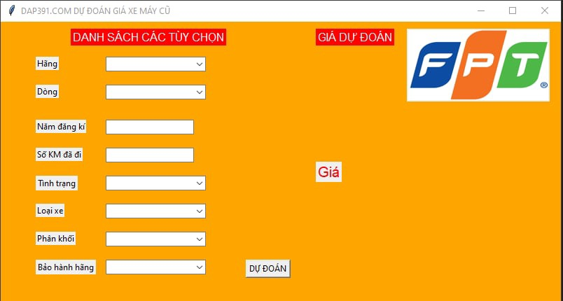
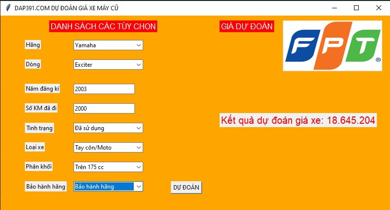

# [MACHINE LEARNING] USED MOTORBIKE PRICE PREDICTION
## Introduction
Society is increasingly modernizing, myself and my family are living in a developing country. In our country in general and in Southeast Asian countries in particular, motorbikes are a very convenient vehicle, suitable for the terrain and economy of each country. And in order to promote the development of this product, help people avoid being scammed and have a clearer assessment of this product, our group of 5 people from FPT University Hanoi has developed Develop a small project Used Motorcycle Price Prediction. Our product will use the tkinter interface as follows: 
       
## Solution
Use machine learning models such as Decision Tree, Random Forest, KNN Regressor, Ridge Regression, Lasso Regression, then choose the best model.
## Dataset
Data will be collected from [trang này](https://xe.chotot.com/mua-ban-xe-may-ha-noi), during data collection I encountered conditions such as Access Denied (403 Forbidden), Data Inconsistency, Security and CAPTCHA processing.
## Run code
Step 1:
```
pip install requirements.txt
```
Step 2: Run file Code_Mini_DAP391.ipynb